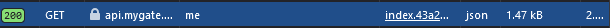

# 🤖 MyGate Network Bot

<div align="center">


**Automated MyGate Network Bot with Multiple Account Support and Auto Quest Feature**

</div>

## ✨ Features

- 🔄 Automatic node registration and management
- 🤖 WebSocket connection handling with auto-reconnect
- 🎯 Automatic quest completion
- 📊 Regular status updates
- 🔒 Proxy support (HTTP/SOCKS4/SOCKS5)
- 📱 Multi-account support
- 🛡️ Error handling & auto retry
- 📝 Clean and consistent logging

## 🏗️ Project Structure
```
myGateBot/
├── config/
│   ├── api.js         # API endpoints configuration
│   └── headers.js     # Request headers configuration
├── services/
│   ├── account.js     # Account management logic
│   ├── api.js         # API interaction methods
│   └── websocket.js   # WebSocket connection handling
├── utils/
│   ├── banner.js      # ASCII art banner
│   ├── file.js        # File operations
│   ├── logger.js      # Logging utility
│   └── proxy.js       # Proxy agent creation
├── main.js            # Main application entry
└── package.json       # Project configuration
```

## 📦 Installation

1. Clone the repository:
```bash
git clone https://github.com/mbrx10/myGateBot.git
cd myGateBot
```

2. Install dependencies:
```bash
npm install
```

## 🔑 Token Configuration

3. Create tokens.txt file with your account tokens
```bash
touch tokens.txt
```

- Add your tokens to the tokens.txt file
```bash
nano tokens.txt
```

## 🌐 Proxy Configuration

4. Create proxy.txt file with your proxies (Optional)
```bash
touch proxy.txt
```

- Add your proxies to the proxy.txt file
```bash
nano proxy.txt
```

## 🎮 Getting Your Token

There are two ways to obtain your MyGate Network token:

### Method 1: Using Network Tab

1. Login to [MyGate Network](https://app.mygate.network/login?code=oKGZ2W)
2. Open Developer Tools (F12 or Right Click > Inspect)
3. Go to the Network tab
4. Look for API responses containing the authentication token
5. Copy the token from the response header or body

### Method 2: Using Console
1. Login to [MyGate Network](https://app.mygate.network/login?code=oKGZ2W)
2. Open Developer Tools (F12 or Right Click > Inspect)
3. Go to the Console tab
4. Paste and run the following code:
```javascript
console.log(JSON.parse(JSON.parse(localStorage.getItem("persist:root")).auth).accessToken);
```
5. Copy the token that appears in the console

## ⚙️ Configuration Files

### tokens.txt
```
YOUR_TOKEN_1
YOUR_TOKEN_2
...
```

### proxy.txt (Optional)
```
# HTTP proxies
http://ip:port
http://username:password@ip:port

# SOCKS proxies
socks4://ip:port
socks5://ip:port
```

## ⏱️ Intervals

- 🔄 Node reconnection: Every 10 minutes
- 📊 User info update: Every 11 minutes
- 🎯 Quest checking: Every 24 hours

## 📦 Dependencies

- **axios** - HTTP client for API requests
- **ws** - WebSocket client for real-time connections
- **https-proxy-agent** - HTTP/HTTPS proxy support
- **socks-proxy-agent** - SOCKS proxy support
- **chalk** - Beautiful console output

## 📝 License

This project is licensed under the MIT License - see the [LICENSE](LICENSE) file for details.

## 🤝 Contributing

Contributions, issues and feature requests are welcome!

## ⭐️ Show your support

Give a ⭐️ if this project helped you!
